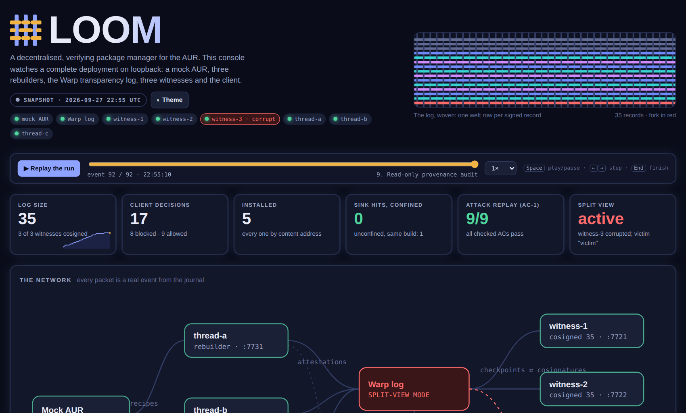
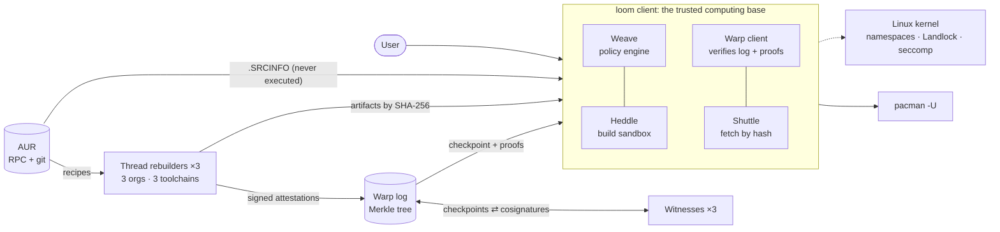
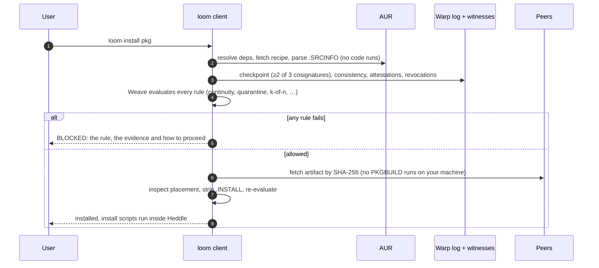
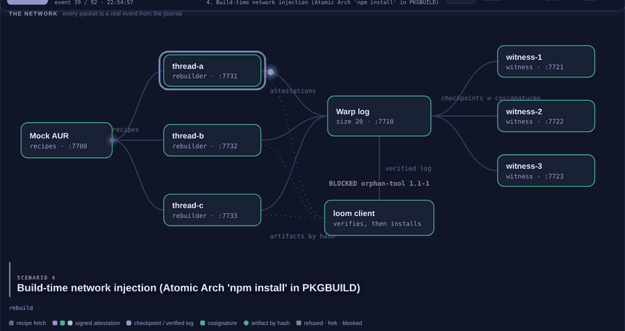

<div align="center">


# Loom

**A decentralised, verifying package manager for the Arch User Repository.**

Install community software only when there is independent, publicly logged evidence that it is what it claims to be,<br>
and run every build in a sandbox that cannot reach your keys or the network.

`Rust` · `Linux ≥ 5.13` · `Apache-2.0` · 11 crates · 75 tests · Major Project, Group 14

</div>

<p align="center"></p>

---

## Contents

- [Why Loom](#why-loom)
- [How it works](#how-it-works)
- [Quick start](#quick-start)
- [The live demo](#the-live-demo)
- [Using the `loom` CLI](#using-the-loom-cli)
- [Results](#results)
- [Security model](#security-model)
- [Repository layout](#repository-layout)
- [Documentation and presentation materials](#documentation-and-presentation-materials)
- [Team](#team)

## Why Loom

Installing from the AUR means running a stranger's shell script as **you**:

1. `yay -S pkg` downloads a PKGBUILD from the AUR's git server;
2. `makepkg` runs it with your privileges, so its `build()` can read `~/.ssh`, `~/.aws`, browser data and tokens, and open network connections;
3. `pacman -U` then installs the result as root and runs its install hooks as root.

Nothing is reviewed or signed, and when a maintainer abandons a package **anyone can adopt it** and push a new version to every existing user. Recent supply-chain attacks exploit exactly this: orphan adoption, account takeover, payloads fetched at build time, credential-harvesting worms, and persistence hooks that run on every future transaction.

Loom replaces `yay`/`paru`/`makepkg` at the point of installation. It is a **trust-and-containment** system, not a malware scanner, and it needs **no cooperation** from the AUR, from maintainers or from upstream. That constraint matters because the attacks target packages that have no active maintainer.

## How it works

Loom combines five independent defences, so no single bypass is catastrophic. The evaluation's ablation study shows every one of them is the *only* thing that catches at least one attack.

| Defence | What it guarantees | Stops |
|---|---|---|
| **Heddle** (build sandbox) | Every build and install script runs in fresh Linux namespaces with Landlock and a seccomp-BPF filter: `$HOME` does not exist, the network is empty, nothing outside the build directory is writable. A build that even *tries* to read credentials or open a socket is rejected, even if it exits 0. | credential theft, build-time injection, worms |
| **Thread + Weave** (k-of-n rebuilds) | An artifact is installed only if *k* organisationally- and toolchain-independent rebuilders reproduce it bit-for-bit. Any self-verified rebuilder that disagrees blocks it. | artifacts that do not match their source, compromised CI |
| **Quarantine** | New versions are held for 72 hours; security fixes listed in the advisory feed skip the wait. | fast-moving worms and mass-published malware |
| **Continuity** | Any change of maintainer, upstream signing key or recipe history (including orphan adoption and force-push) is detected, from the local install record *and* from the log's own history. | orphan adoption, account takeover, rewritten history |
| **Warp** (transparency log) | Every attestation and revocation goes into an append-only Merkle log whose checkpoints are cosigned by independent witnesses; clients detect split views. | a log operator hiding records or showing a victim a forked history |

A sixth check, the **placement policy**, inspects what a package would install and blocks persistence vectors that no build sandbox can see, such as pacman hooks, `ld.so.preload`, Python `.pth` startup files and setuid binaries.

### Architecture



Everything that crosses into the client is verified by a hash or a signature before use. Any verification, log or sandbox error **refuses**; there is never a fallback to unverified data or an unconfined build.

### What happens on `loom install`



When *k* rebuilders agree, the attested artifact is fetched by content address, so **no PKGBUILD code ever runs on the user's machine**. Only if no peer can serve it does Loom build locally, inside Heddle.

## Quick start

**Requirements:** Linux with kernel ≥ 5.13 (Landlock), a Rust toolchain, and `git`, `gcc`, `curl`, `python3` and `ss` (from `iproute2`). With unprivileged user namespaces you get the **full** sandbox tier; without them Loom runs the **reduced** tier (Landlock + seccomp) and says so. Without Landlock it refuses to build. macOS and WSL2 are not supported, because the sandbox is built from Linux kernel features.

```sh
git clone https://github.com/arino08/loom && cd loom
cargo build                       # the workspace
python3 demo/fixtures/genfix.py   # materialise the demo package fixtures
demo/run.sh                       # the whole deployment and all nine scenarios (~70 s)
```

Then:

```sh
cargo test --workspace            # 75 unit and integration tests
cargo run -p loom-eval            # acceptance-criteria harness (E1, E2, E4, E5, E6)
LOOM_KERNEL_TESTS=1 cargo test -p loom-heddle --test escape   # adversarial sandbox-escape suite
```

## The live demo

`demo/run.sh` provisions keys and configuration, then starts a complete deployment on loopback: a mock AUR, the Warp log, three witnesses, three rebuilders with their artifact peers, and a live console. Every component is a separate process with its own keys. The "malicious" packages are **inert probes**: they read a planted decoy file and ping a local test server, and nothing leaves the machine.

| # | Scenario (modelled on) | What stops it | Outcome |
|---|---|---|---|
| 1 | A healthy package | 3 of 3 rebuilders agree, log verified | installed by hash; no PKGBUILD ran |
| 2 | A brand-new release, then a CVE fix | quarantine, then the advisory fast-path | new release held; fix allowed |
| 3 | Orphan adoption by a new maintainer | continuity; rebuilders refuse the hostile build | blocked before building |
| 4 | `npm install` inside a PKGBUILD | Heddle denies `$HOME` and the socket; rebuilders refuse | blocked; nothing reaches the network |
| 5 | Force-push plus a planted pacman hook | continuity, and placement even after an override | blocked twice |
| 6 | Python `.pth` startup hook | placement policy | blocked |
| 7 | The same malicious build, confined vs unconfined | Heddle | **0** sink hits confined, **1** unconfined |
| 8 | Hostile log with a corrupt witness (split view) | honest witnesses refuse to cosign the fork | victim's client rejects it |
| 9 | Read-only provenance audit | `loom audit` | 5 / 5 packages covered |

Run a single scenario with `demo/run.sh <name>` (`healthy`, `quarantine`, `orphan`, `npm`, `sandbox`, `forcepush`, `placement`, `splitview`, `audit`).

### The deployment console

While the demo runs, open **http://127.0.0.1:7790**. Every animation on it is a real event from the run's journal:

<p align="center"></p>

- **The network:** recipes, attestations, checkpoints, cosignatures and artifacts travel their real paths; honest witnesses visibly refuse the forked log; verdicts flash on the client.
- **The log, woven:** one row per signed record, coloured by rebuilder. Click any record to see its RFC 6962 inclusion-proof path climbing to the root.
- **Replay:** scrub to any moment of the run, or play it back at up to 4× (Space, ←/→).
- **Defence matrix, sandbox contrast, acceptance results and a filterable event journal.**

At the end of a run the console is saved as a self-contained `$LOOM_HOME/report.html`; [`docs/demo-report.html`](docs/demo-report.html) is one such snapshot. Set `LOOM_HOLD=1` to keep everything running after the last scenario.

### Presenting it

```sh
demo/present.sh            # checks the laptop, then one keypress per scenario
demo/present.sh --from 6   # resume at a step
```

`present.sh` announces whose turn it is and what to point at, keeps each scenario live while you talk, and stops it cleanly on **Enter**. The full running order is in [`presentation/`](presentation/).

## Using the `loom` CLI

| Command | What it does |
|---|---|
| `loom install <pkg>…` | Resolve, verify, obtain (attested artifact or sandboxed build) and install; `--dry-run`, `--json`, `--timings` |
| `loom verify <pkg> [--build]` | Run the full decision without installing |
| `loom explain <pkg>` | The complete trust derivation: every attestation, rule and piece of evidence |
| `loom audit [--json]` | Read-only provenance report for this system |
| `loom log` | Show the verified transparency-log state |
| `loom policy [show\|validate\|default]` | Inspect or check the active policy |
| `loom override add\|list\|rm` | Persistent, recorded exceptions (listed by `loom audit`) |
| `loom sandbox-check` | Which sandbox tier this host provides |

Every block names the rule that fired, the evidence and the exact command to proceed:

```text
orphan-tool 1.1-1 — BLOCKED (pre-build)
  [FAIL] publishing-authority continuity (FR-8.x)
         maintainer changed — policy on_continuity_change = block
           - [FR-8.2] maintainer changed: bob → mallory; prior value last seen …
         fix: review the new maintainer's changes (loom explain orphan-tool),
         then if you trust them: loom override add continuity orphan-tool --reason "…"
```

The services run under `loomd`: `warp` (the log), `witness`, `thread` (a rebuilder), `peer`, `revoke` and `keygen`. `loom-testbed` provisions the demo, serves the mock AUR and the console, and writes reports. Policy and configuration are documented in [docs/CONFIG.md](docs/CONFIG.md); the secure default is `k = 2`, 2-of-3 witnesses, a 72-hour quarantine and *block* on any continuity change.

## Results

From the acceptance-criteria harness (`cargo run -p loom-eval`) over a labelled corpus of incident classes:

| Experiment | Criterion | Result |
|---|---|---|
| E1 attack replay | ≥ 90 % of malicious cases blocked before any payload runs | **9 / 9** |
| E2 false positives | ≤ 5 % of benign packages blocked | **0 / 7** |
| E4 ablation | no single mechanism catches everything | best single mechanism: **3 / 9** |
| E5 overhead | decision < 500 ms, verification < 100 ms | **8.3 µs** and **60 µs** (release build) |
| E6 log integrity | split views detected in 100 % of trials | **200 / 200** |

Build compatibility (E3) is measured by the live demo rather than gated. Details are in [docs/EVALUATION.md](docs/EVALUATION.md).

## Security model

**Cryptography.** Loom uses no bespoke cryptography: two audited primitives from two audited crates.

| Primitive | Used for |
|---|---|
| SHA-256 (`sha2`) | content addresses for artifacts and sources, Merkle hashing, key and toolchain IDs |
| Ed25519 (`ed25519-dalek`, `verify_strict`) | rebuilder attestations, log checkpoints, witness cosignatures |
| DSSE + in-toto Statement v1 | length-prefixed, type-bound envelopes for attestations and revocations |
| Canonical JSON (RFC 8785 subset) | deterministic bytes for every signed record |
| RFC 6962 Merkle tree (`0x00` leaf / `0x01` node) | inclusion and consistency proofs |
| C2SP signed-note checkpoints and cosignature/v1 | log signatures (alg `0x01`) and witness cosignatures (alg `0x04`), never interchangeable |

**Threat model.** In scope: compromised or adopted maintainer accounts, compromised CI, artifacts that do not match their source, build- and install-time payloads, self-propagating worms, a hostile peer network, a minority of malicious rebuilders or witnesses, and a log that equivocates. See [docs/SRS.md §4](docs/SRS.md).

**What Loom deliberately does not claim.** Attestation proves that an artifact *corresponds to its source*, not that the source is *benign*: malicious source that every rebuilder faithfully reproduces is out of scope, which is why the sandbox, quarantine, continuity and placement checks exist alongside it. Also out of scope: ≥ *k* colluding independent rebuilders, breaks of SHA-256 or Ed25519, and kernel escapes on a correctly configured host. In this prototype rebuilder independence is simulated on one host and log admission is permissioned.

## Repository layout

```
crates/
  loom-core      shared, AUR-agnostic types: digests, canonical JSON, DSSE, Ed25519 keys,
                 in-toto schema, vercmp, the ecosystem Backend trait, event journal
  loom-warp      RFC 6962 Merkle log, C2SP checkpoints, witnesses, client-side verifier
  loom-heddle    the least-privilege build executor (namespaces, Landlock, seccomp-BPF)
  loom-shuttle   content-addressed artifact store and peer transport
  loom-weave     the policy engine: independence, contradiction, quarantine, continuity,
                 placement and explained decisions
  loom-aur       the AUR backend (all AUR knowledge lives here)
  loom-thread    the rebuilder: two varied builds → a signed attestation
  loom-client    configuration, trust root, state and the install pipeline
  loom-cli       the `loom` client and `loomd` service binaries
  loom-testbed   mock AUR, provisioning and the deployment console
  loom-eval      the acceptance-criteria harness
demo/            run.sh, present.sh and the package fixtures
docs/            specification, architecture, evaluation, configuration, sandbox
presentation/    review deck, speaker scripts, run of show, technical report
```

`loom-weave`, `loom-warp`, `loom-thread` and `loom-heddle` know nothing about the AUR. Ecosystem logic is isolated behind `loom_core::ecosystem::Backend`, so npm, PyPI or crates.io backends would slot in without touching the security engines.

## Documentation and presentation materials

| Document | Contents |
|---|---|
| [docs/SRS.md](docs/SRS.md) | Software Requirements Specification (LOOM-SRS-001) |
| [docs/ARCHITECTURE.md](docs/ARCHITECTURE.md) | design, subsystems, trust model and the architecture-audit decisions |
| [docs/SANDBOX.md](docs/SANDBOX.md) | the confinement layers, tiers and their limits |
| [docs/EVALUATION.md](docs/EVALUATION.md) | the experiments and how to run them |
| [docs/TRACEABILITY.md](docs/TRACEABILITY.md) | requirements → threats → incidents → code → tests |
| [docs/CONFIG.md](docs/CONFIG.md) | policy and client configuration |
| [presentation/](presentation/) | the IEEE-style review deck, four speaker scripts, the run of show, and the technical design and security report |

## Team

Major Project, **Group No. 14**

| Member | Roll No. |
|---|---|
| Aiman Haque | 231415 |
| Zoya Mulani | 231435 |
| Aariz Sheikh | 231453 |
| Yusuf Aslam | 231460 |

## License

[Apache-2.0](LICENSE).
